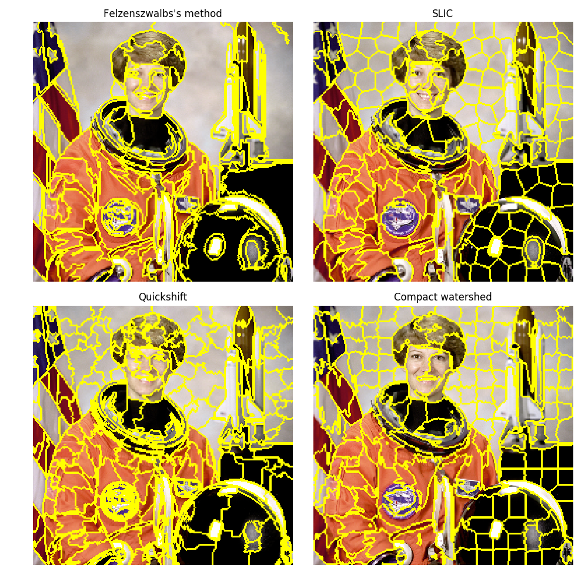

## Text.ipynb

> Four methods along with LIME are implemented for comparison. 
>
> Six text from "fetch_20newsgroups" dataset are used for test.

Four methods in the result: 

The first three use probability, and the last one uses label.

+ Method delete words

  This part correlates to the "**unary_delete_words_abs_prob**" function in the code.

  The model is trained using training dataset. Now for an individual datapoint (a text) from test dataset, we compare the **probability** when a word appear or disappear in that text. In order to disappear a word, we can delete that word manually from the original text.

  Absolute value of probability change is used for the measurement.

+ Method influence_abs_prob

  This part correlates to the "**unary_individual_influence_abs_prob**" function in the code. 

  The model is trained using training dataset. Now for an individual datapoint (a text) from test dataset, we random sample the value of a feature (a word) and compare the **probability** with that for original text. The random value is chosen from the test dataset, the value of the same feature.

  Absolute value of probability change is used for the measurement.

+ Method influence_equal_prob

  This part correlates to the "**unary_individual_influence_equal_prob**" function in the code. 

  The model is trained using training dataset. Now for an individual datapoint (a text) from test dataset, we random sample the value of a feature (a word) and compare the **probability** with that for original text. The random value is chosen from the test dataset, the value of the same feature.

  Different form the above one, here we just focus on whether the probability equals or not equal to the original value.

  The total times of probability change is counted and its mean value is used for the measurement.

+ Method influence_equal_label

  This part correlates to the "**unary_individual_influence_equal_label**" function in the code. 

  The model is trained using training dataset. Now for an individual datapoint (a text) from test dataset, we random sample the value of a feature (a word) and compare the **label** with that for original text. The random value is chosen from the test dataset, the value of the same feature.

  The total times of label change is counted and its mean value is used for the measurement.

  ​

## Image.ipynb

> Image segmentation algorithm is used to spilt an image into several zones. Each zone is considerd as a feature for this image.
>
> MNIST dataset is used for test.

+ Segmentaion

  **Quickshift(.)** function is used to do image segmentation. This function is provided by "**skimage.segmentation**", which is a python package. The segmentation matrix is shown in the ipython notebook. 

  We also tried other segmentation method, such as Felzenszwalbs, SLIC, and Compact watershed (not shown in the ipython notebook). An example of these four segmentation method is shown as follows:

  

  Corrently, I think quickshif is the best choice, since other three methods will split the image into too many zones when I tried on MNIST dataset, more than 20 zones. Maybe I did not use the correct parameter. I will check this latter.

+ Qii for each zone

  Each zone of that image is considered as a feature.

  The model is trained using training dataset. Now for an individual datapoint (an image) from test dataset, we random sample the pixels of a feature (a zone) and compare the **label** with that for original image. The random pixels are chosen from the test dataset, the same position from other image.

  The total times of label change is counted and its mean value is used for the measurement.